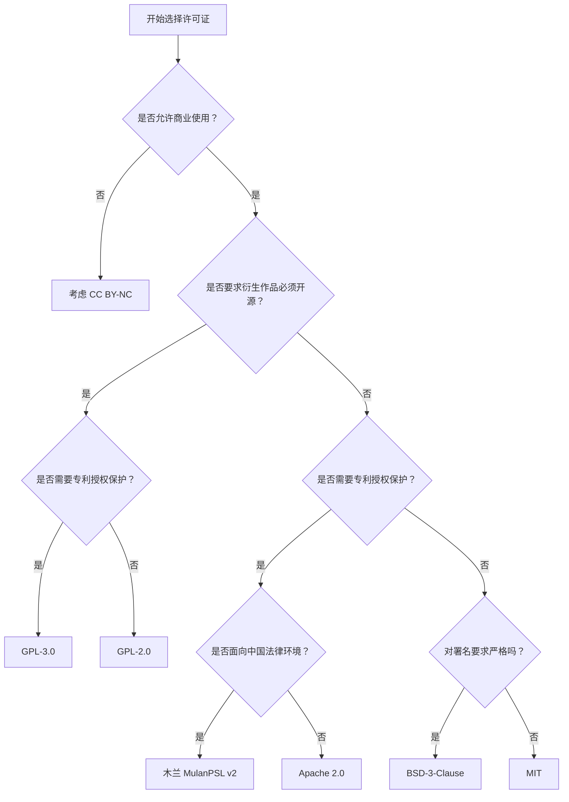

# 开源许可证合规快速指南与微型 SCA 检测工具


> 本项目是基于《开源软件与安全》课程实践构建的综合指南。涵盖了主流许可证（MIT/Apache/GPL/MulanPSL）的演进与对比，并实现了一个微型的 **SCA (软件成分分析)** 脚本。
>
> **核心理念：** 在软件开发的最早期，通过自动化 CI/CD 流水线检测 `requirements.txt` 中的依赖合规风险，预防开源许可证传染与侵权。


# 开源许可证合规快速指南与微型 SCA 检测工具

     

> 本项目是基于《开源软件与安全》课程实践构建的综合指南。涵盖主流许可证（MIT / Apache / GPL / BSD / MulanPSL）的演进与对比，并实现了一个微型的 **SCA（软件成分分析）** 脚本，配合 GitHub Actions CI/CD 流水线，实现依赖合规的自动化检测。 
>
> > **核心理念：** 在软件开发的最早期，通过自动化 CI/CD 流水线检测 `requirements.txt` 中的依赖合规风险，预防开源许可证传染与侵权。


## 目录    

- [主流许可证概览](#主流许可证概览)

- [如何选择许可证](#如何选择许可证)

- [SBOM 简介](docs/sbom-intro.md)

- [许可证深度对比](docs/comparison.md)

- [license_checker.py 使用说明](#license_checkerpy-使用说明)

- [DevSecOps 自动化流水线](#devsecops-自动化流水线)

- [参考资料](#参考资料)


## 主流许可证概览

| 许可证       | 商业使用 | 修改 | 分发 | 专利授权 | 传染性   | 免责声明 |
| ------------ | -------- | ---- | ---- | -------- | -------- | -------- |
| MIT          | ✅        | ✅    | ✅    | ❌        | ❌        | ✅        |
| Apache 2.0   | ✅        | ✅    | ✅    | ✅        | ❌        | ✅        |
| GPL-3.0      | ✅        | ✅    | ✅    | ✅        | ✅ 强传染 | ✅        |
| LGPL-2.1     | ✅        | ✅    | ✅    | ✅        | ⚠️ 弱传染 | ✅        |
| BSD-2-Clause | ✅        | ✅    | ✅    | ❌        | ❌        | ✅        |
| BSD-3-Clause | ✅        | ✅    | ✅    | ❌        | ❌        | ✅        |
| MulanPSL v2  | ✅        | ✅    | ✅    | ✅        | ❌        | ✅        |

> 完整对比、兼容性矩阵与真实案例分析见 [docs/comparison.md](


## 如何选择许可证




## license_checker.py 使用说明

本脚本模拟了企业级 SCA 工具的核心功能：读取 `requirements.txt`，对照内置的许可证知识库，自动输出每个依赖的许可证类型与合规风险提示。

**运行方式：**

```bash
python license_checker.py requirements.txt
```

**示例输出：**

```
🔍 正在扫描依赖文件: requirements.txt
------------------------------------------------------------

[✅ OK]    requests        -> Apache 2.0   包含专利授权条款，商业友好
[✅ OK]    flask           -> BSD-3-Clause 宽松许可，禁止用作者名义背书
[⚠️ 注意]   gpl-lib         -> GPL-3.0      传染性许可证，衍生作品须以相同协议开源，商业项目需谨慎

[❔ 未知] unknown-package -> ❓ 未在本地合规数据库中找到对应信息
------------------------------------------------------------

🎯 扫描完成！请注意：本工具仅供合规参考，不构成法律意见。
```


## DevSecOps 自动化流水线

本项目配置了 GitHub Actions CI 流水线（`.github/workflows/license-check.yml`），将许可证合规检测集成到代码提交环节。 

**触发条件：** 每次向 `main` 分支发起 `push` 或 `pull_request` 时自动触发。

**流水线执行步骤：** 

1. 检出代码（`actions/checkout`） 
2. 配置 Python 3.10 运行环境 
3. 自动运行 `license_checker.py` 对 `requirements.txt` 进行扫描

**设计意义：** 模拟现代企业 DevSecOps 实践中的**合规左移**理念——不等到项目上线后再审计许可证风险，而是在每次代码提交时即自动拦截潜在的 GPL 传染性依赖，防止开发者因疏忽引入不合规组件。这也是成熟开源社区保障生态健康的关键手段。


## SBOM 简介

SBOM（Software Bill of Materials，软件物料清单）是描述软件组成成分的结构化清单，记录项目依赖的所有开源组件、版本号及许可证信息。 

当高危漏洞（如 Log4Shell）爆发时，拥有完整 SBOM 的团队可以在数分钟内定位受影响的项目，而无 SBOM 的团队往往需要数天的人工排查。 

主流格式：**SPDX**（Linux 基金会，侧重许可证合规）和 **CycloneDX**（OWASP，侧重安全漏洞分析）。 

> 详细介绍与格式示例见 [docs/sbom-intro.md](docs/sbom-intro.md)


## 参考资料

-  [Choose an open source license](https://choosealicense.com/) 
-  [SPDX License List](https://spdx.org/licenses/) 
-  [Open Source Initiative (OSI)](https://opensource.org/licenses) 
-  [CycloneDX 规范](https://cyclonedx.org/) 
-  [NTIA SBOM 最低要素](https://www.ntia.gov/sbom) 
-  [木兰开源许可证](http://license.coscl.org.cn/MulanPSL2) 
-  [Conventional Commits 规范](https://www.conventionalcommits.org/zh-hans/)


