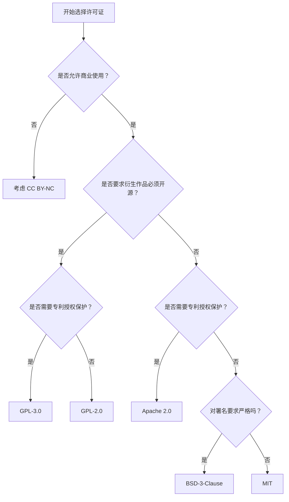

# 开源许可证合规与安全快速指南（中文版）


> 面向开发者与学习者的开源许可证合规入门指南，涵盖主流许可证对比、选择决策、SBOM 简介及自动化风险检测脚本。

---

## 目录

- [许可证对比](docs/comparison.md)
- [如何选择许可证](#如何选择许可证)
- [SBOM 简介](docs/sbom-intro.md)
- [license_checker.py 使用说明](#license_checkerpy-使用说明)
- [参考资料](#参考资料)

---

## 主流许可证概览

| 许可证 | 商业使用 | 修改 | 分发 | 专利授权 | 传染性 | 免责声明 |
|--------|----------|------|------|----------|--------|----------|
| MIT | ✅ | ✅ | ✅ | ❌ | ❌ | ✅ |
| Apache 2.0 | ✅ | ✅ | ✅ | ✅ | ❌ | ✅ |
| GPL-3.0 | ✅ | ✅ | ✅ | ✅ | ✅ | ✅ |
| BSD-2-Clause | ✅ | ✅ | ✅ | ❌ | ❌ | ✅ |
| BSD-3-Clause | ✅ | ✅ | ✅ | ❌ | ❌ | ✅ |

> 详细说明见 [docs/comparison.md](docs/comparison.md)

---

## 如何选择许可证



---

## SBOM 简介

SBOM（Software Bill of Materials，软件物料清单）是描述软件组成成分的结构化清单，记录了项目依赖的所有开源组件及其许可证信息。

主流格式包括 **SPDX**（Linux 基金会主导）和 **CycloneDX**（OWASP 主导）。

> 详细介绍与示例见 [docs/sbom-intro.md](docs/sbom-intro.md)

---

## license_checker.py 使用说明

本脚本可读取 `requirements.txt`，自动识别依赖包的许可证类型并输出合规风险提示。

**运行方式：**

```bash
python license_checker.py requirements.txt
```

**示例输出：**
[✅ OK]     requests        -> Apache 2.0   包含专利授权条款，商业友好 [✅ OK]     flask           -> BSD-3-Clause 宽松许可，禁止用作者名义背书 [⚠️ 注意]  gpl-lib         -> GPL-3.0      传染性许可证，衍生作品须以相同协议开源，商业项目需谨慎

---

## 参考资料

- [Choose an open source license](https://choosealicense.com/)
- [SPDX License List](https://spdx.org/licenses/)
- [Open Source Initiative (OSI)](https://opensource.org/licenses)
- [CycloneDX 规范](https://cyclonedx.org/)
- [NTIA SBOM 最低要素](https://www.ntia.gov/sbom)
